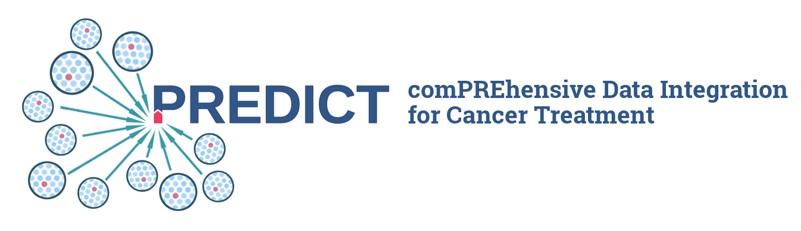

.. I-VIS documentation master file

Welcome to I-VIS
================

Release v\ |version|. (`install`_)

I-VIS is a open-source, MIT-licensed tool to setup an Integrated Variant Information System that have
been developed within the `PREDICT project`_.

I-VIS consists of the following python packages:

* `i_vis_api`_ provides a database and an API to integrated data.
* `i_vis_core`_ core functionality - shared between `i_vis_api`_ and `i_vis_report`_.
* `i_vis_report`_ enables reporting - requires an existing running instance of `i_vis_api`_.

I-VIS is build with flask (https://flask.palletsprojects.com/) as the underlying microservice framework. Pandas is
extensively used for data transformation. DASK is used to run workflows in parallel.

.. _install:

Installation
------------

I-VIS can be installed from:

.. toctree::
   :maxdepth: 1

   install/repository
   install/docker

Installation via :ref:`install-repository` requires **manual** setup of a runtime environment:
- Python and package dependencies
- MySQL database server
- WSGI Server (optional)

We recommend installation via :ref:`install_docker`.
`config`_ is slightly different depending on how `i_vis_api`_ has been installed.

.. _config:

Configuration
-------------

`i_vis_api`_ requires a minimal configuration file that is provided by the environmental variable 'envar':`I_VIS_CONF`.
The configuration defines:
- connection to a MySQL database,
- `flask or flask-plugin <config:flask>`_ specific configuration keys,
- general I-VIS specific settings, e.g.: :data:`I_VIS_DATA_DIR` or :data:`I_VIS_LOG_DIR`, and
- I-VIS plugins.

.. toctree::
   :maxdepth: 1

   config/flask
   config/i_vis
   config/logging

.. init:

Init I-VIS
----------

Update internal data source version repository:

.. code-block:: console

   $ i-vis.sh plugin update

Start, ETL workflow and upgrade all plugins to latest available version:

.. code-block:: console

   $ i-vis.sh plugin upgrade

.. start:

Start I-VIS API
---------------

Start I-VIS API Server:
.. code-block:: console

   $ .i-vis-api.sh run

You should be able to access I-VIS API under:

.. code-block:: console

   $ curl -v https://localhost:5000/api

.. _plugins:

* :ref:`genindex`
* :ref:`modindex`
* :ref:`search`

